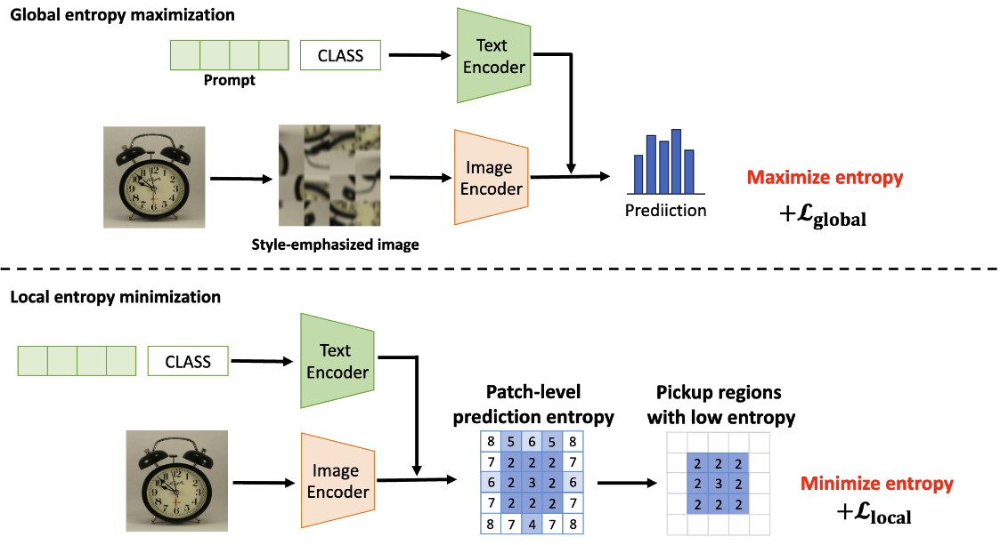

## [BMVC 2024] Region-based Entropy Separation for One-shot Test-Time Adaptation

## Abstruct
In the paper, we address One-shot Test-Time Adaptation, which adapts a classification model using only a given single unlabeled test image. All the existing methods fine-tune the model so that the classification results are consistent for augmented views of a given test image. However, each region of an image has different information; some regions have rich class (object) information, while others express style information essentially irrelevant to the class information. The existing approach based on the image-level classification results is therefore inadequate. To address this problem, we propose a novel One-shot Test-Time Adaptation method based on region-based entropy separation. Specifically, our method aims to obtain style-invariant features by performing global entropy maximization as well as local entropy minimization only on the regions with high confidence values where the class information is considered to be strongly represented. Experimental results on three public benchmark datasets show that the proposed method outperforms the state-of-the-art One-shot Test-Time Adaptation methods.

## Method Overview

Code is currently under construction. Stay tuned for updates!
